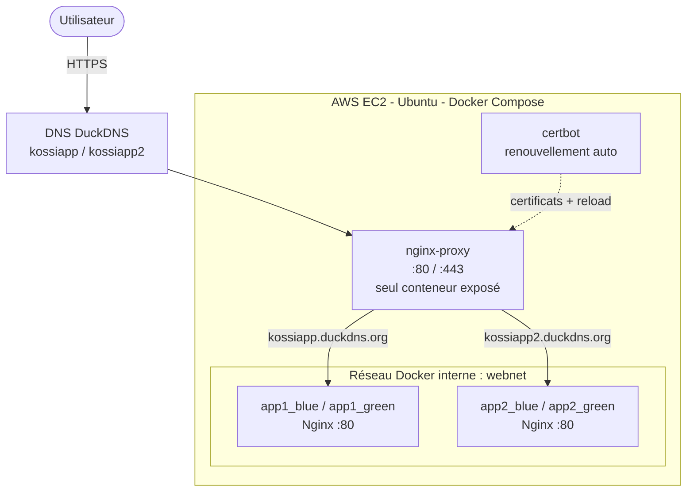
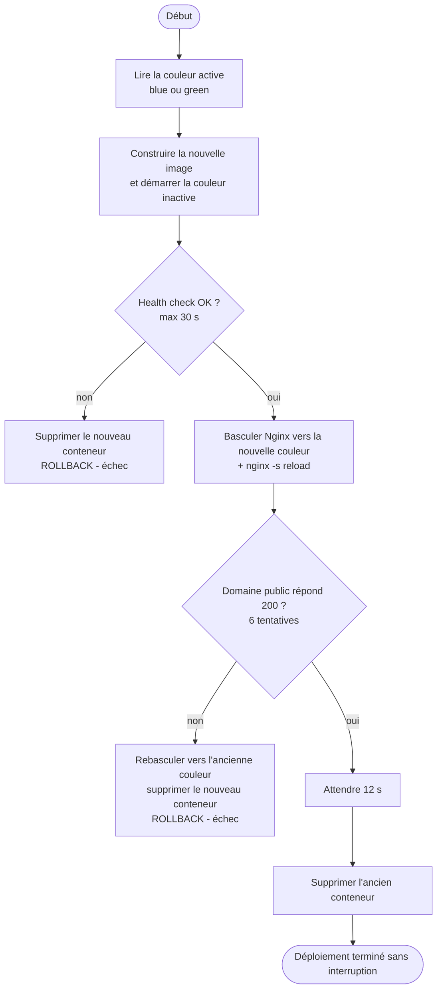
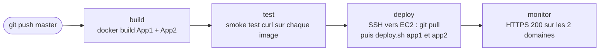

# CI-CD_deploy

[](https://github.com/kossibihaho/CI-CD_deploy/actions/workflows/deploy.yml)


Infrastructure cloud construite de A à Z sur un serveur vierge **AWS EC2** : deux applications web conteneurisées, exposées en **HTTPS** derrière un **reverse proxy Nginx**, avec des certificats **Let's Encrypt** renouvelés automatiquement, un déploiement **Blue-Green sans coupure de service** et un **pipeline CI/CD GitHub Actions** (build → test → deploy → monitoring).

> 📄 Le déroulé complet de la réalisation, étape par étape et avec captures d'écran, est dans le [rapport de travail (PDF)](Rapport_du_travail_CI-CD_deploy.pdf).

---

## Sommaire

- [Objectifs](#-objectifs)
- [Architecture](#-architecture)
- [Stack technique](#-stack-technique)
- [Structure du dépôt](#-structure-du-dépôt)
- [Fonctionnement](#-fonctionnement)
- [Installation sur un serveur vierge](#-installation-sur-un-serveur-vierge)
- [Déploiement Blue-Green](#-déploiement-blue-green)
- [Pipeline CI/CD](#️-pipeline-cicd)
- [Sécurité](#-sécurité)
- [Résultats](#-résultats)
- [Difficultés rencontrées et solutions](#-difficultés-rencontrées-et-solutions)
- [Limites et pistes d'amélioration](#-limites-et-pistes-damélioration)
- [Commandes utiles](#️-commandes-utiles)
- [Crédits](#-crédits)

---

## 🎯 Objectifs

Mettre en production **2 applications conteneurisées**, accessibles en HTTPS via un reverse proxy, sur un **même serveur**, avec :

- un **point d'entrée unique** exposé à Internet ;
- un routage **par sous-domaine** ;
- des certificats HTTPS **obtenus et renouvelés automatiquement** ;
- une mise à jour des applications **sans interruption** (Blue-Green) ;
- un **pipeline CI/CD** qui automatise tout, du `git push` à la vérification en production.

---

## 🏗️ Architecture




- **Un seul conteneur exposé publiquement** (`nginx-proxy`, ports 80 et 443). Les applications ne sont jamais accessibles directement depuis Internet.
- **Routage par nom de domaine** (`server_name`) vers le bon service.
- **Blue-Green** : deux versions d'une même application coexistent le temps de la mise à jour.
- **Certbot** tourne en continu dans son propre conteneur, renouvelle les certificats et recharge Nginx.

---

## 🧱 Stack technique

| Domaine | Technologies |
|---|---|
| Serveur | AWS EC2 (Ubuntu), connexion SSH par clé |
| Conteneurisation | Docker, Docker Compose |
| Reverse proxy | Nginx 1.27 (routage dynamique via variables) |
| HTTPS | Let's Encrypt, Certbot (challenge HTTP-01), renouvellement automatique |
| DNS | DuckDNS (sous-domaines dynamiques) |
| CI/CD | GitHub Actions (build → test → deploy → monitoring) |
| Déploiement | Blue-Green, health checks, rollback automatique |
| Scripting | Bash |

---

## 📁 Structure du dépôt

```
CI-CD_deploy/
├── .github/workflows/
│   └── deploy.yml              # Pipeline CI/CD (build, test, deploy, monitor)
├── App1/                       # Application 1 (site statique servi par Nginx)
│   └── Dockerfile
├── App2/                       # Application 2 (site statique servi par Nginx)
│   └── Dockerfile
├── nginx-proxy/
│   ├── Dockerfile
│   └── conf.d/
│       ├── default.conf        # server blocks : redirection HTTP→HTTPS, proxy HTTPS
│       └── upstreams/
│           ├── app1_active.conf   # couleur active de l'App1 (blue ou green)
│           └── app2_active.conf   # couleur active de l'App2 (blue ou green)
├── docker-compose.yml          # nginx-proxy, certbot, app1_blue, app2_blue
├── deploy.sh                   # Script de déploiement Blue-Green
├── Rapport_du_travail_CI-CD_deploy.pdf
└── README.md
```

---

## ⚙️ Fonctionnement

### Le reverse proxy

`nginx-proxy` reçoit toutes les requêtes sur les ports 80 et 443 :

- sur le port **80**, il répond au challenge Let's Encrypt (`/.well-known/acme-challenge/`) et redirige tout le reste vers HTTPS (code `301`) ;
- sur le port **443**, il déchiffre le TLS puis transmet la requête au conteneur de l'application correspondant au nom de domaine demandé.

Le conteneur cible n'est pas écrit en dur : il est lu dans un fichier `upstreams/appX_active.conf` qui contient une simple variable, par exemple :

```nginx
set $app1_upstream app1_green:80;
```

Basculer une application d'une version à l'autre revient donc à **modifier ce fichier et recharger Nginx** (`nginx -s reload`), sans redémarrer le conteneur du proxy. Le `resolver 127.0.0.11 valid=10s ipv6=off;` permet à Nginx de résoudre dynamiquement le nom des conteneurs Docker.

### HTTPS automatisé

Le conteneur `certbot` exécute en boucle `certbot renew` toutes les 12 heures. Après chaque renouvellement réel, un `--deploy-hook` recharge Nginx pour qu'il charge le nouveau certificat. Les certificats et le webroot sont partagés avec `nginx-proxy` via des volumes Docker.

### Santé des conteneurs

Chaque application embarque un `HEALTHCHECK` Docker (test `wget` sur sa propre racine toutes les 5 secondes). Le script de déploiement s'appuie dessus pour ne basculer le trafic que vers un conteneur réellement prêt.

---

## 🚀 Installation sur un serveur vierge

**Prérequis** : une instance EC2 Ubuntu, deux sous-domaines DuckDNS pointant vers son IP publique, et un Security Group qui ouvre les ports **22, 80 et 443**.

```bash
# 1. Sur l'hôte : uniquement Docker + Docker Compose
sudo apt update
sudo apt install -y docker.io docker-compose-plugin
sudo systemctl enable --now docker
sudo usermod -aG docker $USER      # puis se reconnecter

# 2. Cloner le dépôt
git clone https://github.com/kossibihaho/CI-CD_deploy.git
cd CI-CD_deploy

# 3. Lancer l'infrastructure
docker compose up -d --build
```

> ⚠️ `default.conf` référence des certificats HTTPS qui n'existent pas encore au tout premier lancement. Pour le premier démarrage, garder uniquement les blocs `listen 80` (nécessaires au challenge HTTP-01), obtenir les certificats (ci-dessous), puis activer les blocs `listen 443` et recharger Nginx.

### 🔒 Obtenir les certificats HTTPS (première fois uniquement)

```bash
docker compose run --rm --entrypoint "certbot" certbot certonly \
  --webroot -w /var/www/certbot \
  -d kossiapp.duckdns.org \
  --email votre@email.com --agree-tos --no-eff-email

docker compose run --rm --entrypoint "certbot" certbot certonly \
  --webroot -w /var/www/certbot \
  -d kossiapp2.duckdns.org \
  --email votre@email.com --agree-tos --no-eff-email

# Recharger Nginx pour charger les certificats
docker compose exec nginx-proxy nginx -s reload
```

Remplacer les noms de domaine et l'adresse e-mail par les vôtres (et adapter `nginx-proxy/conf.d/default.conf` et `deploy.sh` en conséquence).

---

## 🔵🟢 Déploiement Blue-Green

Le script `deploy.sh` met à jour une application sans interruption :

```bash
./deploy.sh app1   # ou app2
```



| Étape | Action |
|---|---|
| 1 | Détection de la couleur active en lisant `appX_active.conf` |
| 2 | Build de la nouvelle image et démarrage du conteneur de la couleur inactive |
| 3 | Attente du statut `healthy` (15 essais, un toutes les 2 s) ; sinon rollback |
| 4 | Bascule du routage Nginx puis `nginx -s reload` |
| 5 | Vérification finale via le **domaine public** (6 essais, rollback automatique si échec) |
| 6 | Suppression de l'ancien conteneur, une fois le trafic confirmé stable |

---

## ⚙️ Pipeline CI/CD

Défini dans [`.github/workflows/deploy.yml`](.github/workflows/deploy.yml). Déclenché à chaque `push` ou `pull_request` sur `master` ; le job **deploy** ne s'exécute que sur `master`.



| Job | Rôle |
|---|---|
| `build` | Construit les images Docker des deux applications |
| `test` | Lance chaque image et vérifie qu'elle répond (`curl -f`) ; affiche les logs en cas d'échec |
| `deploy` | Se connecte à l'EC2 en SSH (`appleboy/ssh-action`), fait un `git pull`, lance `./deploy.sh app1` puis `./deploy.sh app2`, nettoie les images inutilisées |
| `monitor` | Vérifie depuis GitHub que les deux domaines répondent bien **HTTP 200 en HTTPS** |

En cas d'échec d'un job, GitHub envoie une **notification par e-mail**.

### Secrets requis

À définir dans *Settings → Secrets and variables → Actions* :

| Secret | Description |
|---|---|
| `EC2_HOST` | IP publique (idéalement Elastic IP) de l'instance EC2 |
| `EC2_USER` | Utilisateur SSH (`ubuntu`) |
| `EC2_SSH_KEY` | Clé privée SSH **dédiée au déploiement** |
| `EC2_PROJECT_PATH` | Chemin du projet sur l'EC2 |

---

## 🔐 Sécurité

- **Surface d'exposition minimale** : seuls les ports 22, 80 et 443 sont ouverts ; les applications restent dans un réseau Docker interne.
- **SSH par clé uniquement** ; une **paire de clés dédiée** à GitHub Actions, distincte de la clé d'administration, avec ses permissions vérifiées côté serveur.
- **Aucun secret dans le dépôt** : tout passe par les GitHub Secrets.
- **HTTPS partout** : redirection `301` de HTTP vers HTTPS, certificats Let's Encrypt renouvelés automatiquement.

---

## ✅ Résultats

Pipeline complet vert (build, test, deploy et monitor), durée totale d'environ **1 min 33 s** :


Applications accessibles en HTTPS via leur nom de domaine :

| Application 1 | Application 2 |
|---|---|
|  |  |

> ℹ️ **Pour maîtriser les coûts AWS, l'instance EC2 a été arrêtée après la réalisation.** Les domaines ne répondent donc plus ; les captures ci-dessus et le [rapport](Rapport_du_travail_CI-CD_deploy.pdf) en attestent. Pour le remettre en ligne : redémarrer l'instance, mettre à jour DuckDNS si l'IP a changé, puis relancer `docker compose up -d` et `./deploy.sh` pour chaque application (voir la limite sur le redémarrage des conteneurs ci-dessous).

---

## 🧩 Difficultés rencontrées et solutions

| Problème | Solution |
|---|---|
| Échecs du job `monitor` lors des premiers essais du pipeline (notifiés par e-mail) | Corrections successives jusqu'à obtenir un pipeline complet au vert |
| Résolution DNS interne instable dans Nginx | `resolver 127.0.0.11 valid=10s ipv6=off;` : l'IPv6 doit être désactivé |
| Erreur `502` juste après la bascule : le cache DNS de Nginx pointait encore vers l'ancien conteneur | Vérification finale avec **retry** et rollback ; délai de 12 s avant de supprimer l'ancien conteneur, **toujours supérieur** au `valid=` du resolver |
| Certificats non rechargés après renouvellement | `--deploy-hook 'nginx -s reload'` dans le conteneur Certbot |
| Permissions SSH et Nginx très strictes | Vérification des droits des clés et des fichiers côté serveur |

---

## 🔭 Limites et pistes d'amélioration

- **Elastic IP recommandée** : sans elle, l'IP publique de l'EC2 change au redémarrage et désynchronise DuckDNS.
- **Serveur unique** : pas de haute disponibilité au niveau de l'hôte (un seul EC2) ; le Blue-Green protège des coupures liées aux mises à jour, pas d'une panne du serveur.
- **Images construites sur le serveur** : à terme, publier les images dans un registre (GitHub Container Registry) et les tirer sur le serveur, plutôt que de les construire sur place.
- **Tests limités** à des smoke tests (la page répond) : ajouter des tests plus poussés et un scan de sécurité des images (par exemple Trivy).
- **Infrastructure as Code** : provisionner l'EC2, le Security Group et l'IP élastique avec Terraform.
- **Redémarrage de l'hôte** : les conteneurs créés par `deploy.sh` (`docker run`) n'ont pas de politique de redémarrage et ne sont pas définis dans `docker-compose.yml`, qui ne démarre que les versions `blue`. Après un reboot de l'EC2, la couleur active peut donc ne pas redémarrer. À corriger avec `--restart unless-stopped` dans `deploy.sh`.
- **Chemin du projet codé en dur** dans `deploy.sh` (`/home/ubuntu/CI-CD_deploy`) : à paramétrer.

---

## 🛠️ Commandes utiles

```bash
docker compose ps                              # état des conteneurs
docker compose logs nginx-proxy --tail 30      # logs Nginx
docker compose exec nginx-proxy nginx -t       # valider la configuration Nginx
docker compose run --rm certbot certificates   # lister les certificats
docker inspect --format='{{.State.Health.Status}}' app1_blue   # statut du health check
```

---

## 🙏 Crédits

- Applications de démonstration : templates HTML/CSS gratuits de [TemplateMo](https://templatemo.com) (*Edu Meeting* et un template d'administration), utilisés uniquement comme contenu à déployer. Le sujet du projet est l'infrastructure, pas les applications.
- Projet réalisé par **Kossi Bihaho**, élève ingénieur en Réseaux, Systèmes et Services Programmables (ENSA Marrakech), dans le cadre d'un apprentissage pratique du DevOps.
